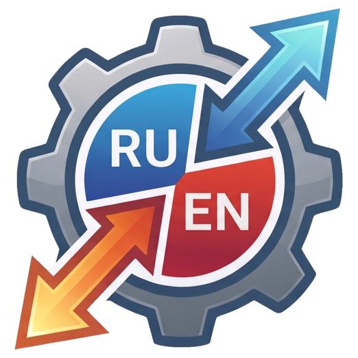

[English](README.md) | [Русский](README.ru_RU.md)

<p align="center">
  
</p>

<h1 align="center">Own Keyboard Switch</h1>
<p align="center">Автоматическое переключение русской и английской раскладки в Windows.</p>

[](https://github.com/coinman-dev/own-keyboard-switch/releases/tag/v0.1.0-beta)
[](https://github.com/coinman-dev/own-keyboard-switch/actions/workflows/release.yml)
[](#скачать)
[](#сборка)
[](LICENSE)

**Own Keyboard Switch** исправляет слова, набранные не в той раскладке:
`ghbdtn` → `привет`, `руддщ` → `hello`. Программа работает в трее, поддерживает
собственные правила, автозамену, инструменты буфера обмена и плавающий индикатор.

> **0.1.0-beta — предварительный релиз для Windows.** Версия для Linux ещё
> в разработке; готовые Linux-сборки пока не публикуются.

## Скачать

| Вариант | Скачать | Как использовать |
|---|---|---|
| Portable | [okbswitch-portable.exe](https://github.com/coinman-dev/own-keyboard-switch/releases/download/v0.1.0-beta/okbswitch-portable.exe) | Положить в доступную для записи папку и запустить. Установка не нужна. |
| Установщик | [okbswitch-install.exe](https://github.com/coinman-dev/own-keyboard-switch/releases/download/v0.1.0-beta/okbswitch-install.exe) | Выбрать установку для себя или всех пользователей, ярлыки и автозапуск. |

Windows 10/11, x64. Словари и языковые модели встроены. Программа не обращается
к сети и не содержит рекламы. [Все релизы](https://github.com/coinman-dev/own-keyboard-switch/releases).

## Быстрый старт

1. Запустите portable-файл или завершите установку.
2. Дважды щёлкните значок в трее, чтобы открыть настройки.
3. При включённом автопереключении наберите слово и нажмите пробел или Enter.
4. **Break** отменяет автоматическое исправление или преобразует текущее слово.

Интерфейс доступен на русском и английском, со светлой, тёмной и системной темой.
Горячие клавиши и исключения приложений меняются в настройках.

## Возможности

- Распознавание RU/EN по встроенным словарям, языковым моделям и дополнительным правилам.
- Опция **«Улучшить переключение»** распознаёт больше строчных английских слов
  длиной 2–3 буквы после русского слова или отдельной буквы. Русские слова и имена защищены.
- Исправление до передачи Enter в PowerShell или Windows-терминал. Для терминалов
  WSL используется Windows-программа; нативный перехват Linux ещё не готов.
- Смена раскладки одной клавишей, исправление регистра и ручная конвертация выделения.
- Автозамена по пробелу, Enter, Tab, подсказке или горячей клавише; многострочные
  записи, запоминаемая позиция курсора и плавающий список вставки.
- Конвертация раскладки, транслитерация, проверка орфографии и история буфера обмена.
- Плавающий индикатор раскладки, настраиваемые флаги в трее и звуки.
- Исключения приложений, проверка полей паролей, автозапуск и запуск с повышением прав.
- Размещение плавающего списка в пределах рабочей области монитора с учётом DPI.

Операции с буфером восстанавливают **обычный текст**; сохранение изображений и
форматирования ещё не реализовано. Сохранение истории между запусками по умолчанию
выключено. При включении в файл могут попасть и скопированные конфиденциальные тексты.

## Настройки и данные

Все рабочие файлы хранятся **внутри папки программы**:

| Файл | Относительный путь |
|---|---|
| Настройки и записи автозамены | `data/config.toml` |
| История буфера, если сохранение включено | `data/clipboard-history.txt` |
| Блокировка экземпляра | `data/okbswitch.lock` |
| Ежедневный журнал | `Logs/okbswitch.<дата>.log` |

Portable-версии нужна доступная для записи папка. При установке для всех
пользователей установщик выдаёт право записи в `data` и `log`, сохраняя защиту exe.
**Автоматического перехода в AppData нет.** Если данные нельзя записать,
программа сообщает об ошибке: нужно выбрать доступную папку или восстановить права установки.

При обычном запуске настройки и история старых версий переносятся из профиля.
Существующие локальные настройки не перезаписываются; старые журналы, резервные
копии и конфликтующие файлы сохраняются в `data/legacy-profile`. Перед переносом
нужно закрыть старую программу. Удаляются только перенесённые файлы и пустые каталоги.

Удаление программы по умолчанию сохраняет настройки; их удаление подтверждается
отдельно. Тихое удаление тоже сохраняет данные. Для резервной копии достаточно
скопировать папку программы.

## Диагностика

```powershell
.\okbswitch-portable.exe --settings
.\okbswitch-portable.exe --paths
.\okbswitch-portable.exe --diagnose
.\okbswitch-portable.exe --debug
.\okbswitch-portable.exe --licenses
```

Установленная версия называется `okbswitch.exe`. Команда `--paths` только
показывает пути, а `--diagnose` не переносит данные профиля. Дополнительный путь
`--config` должен находиться внутри папки программы.

В разделе «Устранение проблем» включите **«Вести отладочный журнал программы»**
и выберите режим Error, Info или Debug. Изменение действует без перезапуска.
Если флажок выключен, файл журнала не создаётся. Набранный текст в журнал не попадает.

## Сборка

Зависимостям интерфейса нужен Rust 1.95 или новее. Windows-релизы собираются MSVC с инструментами
Visual Studio C++ и Windows SDK. Для установщика нужен NSIS.

```powershell
cargo test --workspace --locked
cargo build --release --locked -p okbswitch --target x86_64-pc-windows-msvc
```

Упаковка описана в [tools/build-release.ps1](tools/build-release.ps1).
Из Linux/WSL можно использовать `tools/cross-windows.sh` с llvm-mingw и
`tools/build-installer.sh` с NSIS. Это сборка Windows-программы, а не готовая
нативная версия для Linux.

## Автоматические релизы

Отправка тега версии, например `v0.1.0-beta`, запускает [сборку релиза](.github/workflows/release.yml).
Тег должен совпадать с версией в `Cargo.toml`. GitHub проверяет проект, собирает
Windows x64, создаёт установщик и SHA-256-суммы, а затем публикует готовые файлы.
Предварительные версии автоматически помечаются как prerelease. Сборку можно
повторить вручную для существующего тега. Linux-файлы пока не собираются.

## Лицензия

Собственный код проекта распространяется по **[PolyForm Noncommercial License 1.0.0](LICENSE)**.
Она разрешает использование на предусмотренных ею некоммерческих условиях и
не предоставляет общего разрешения на коммерческое использование.
Обязательное уведомление — [NOTICE](NOTICE).

У сторонних библиотек, шрифтов и языковых данных остаются собственные лицензии.
См. [data/LICENSES.md](data/LICENSES.md) и уведомления, включённые в релиз.
